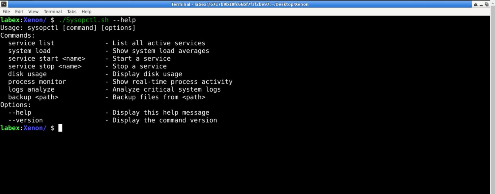
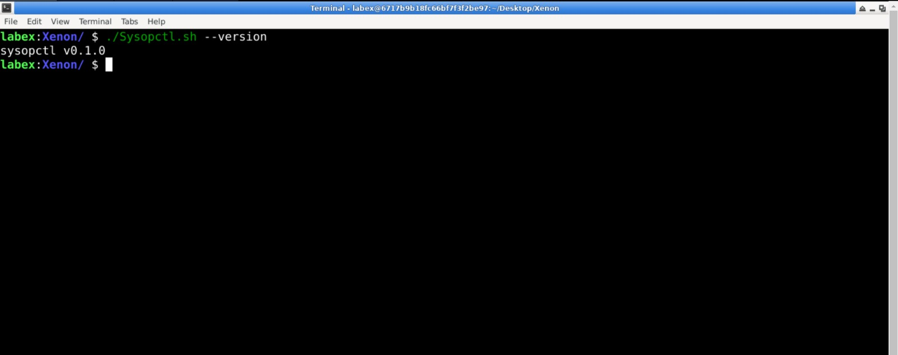
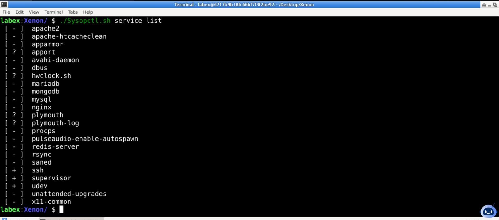
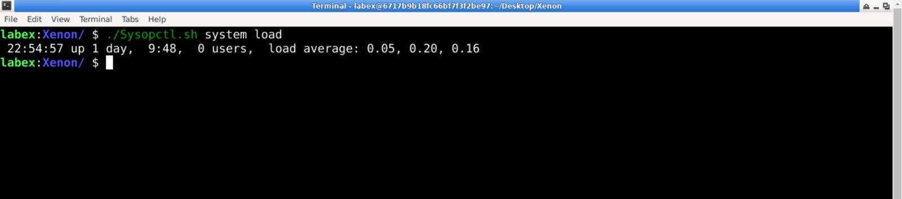
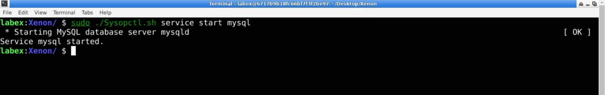
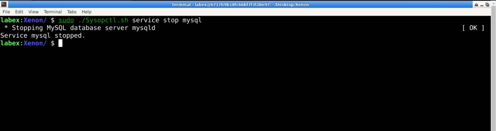
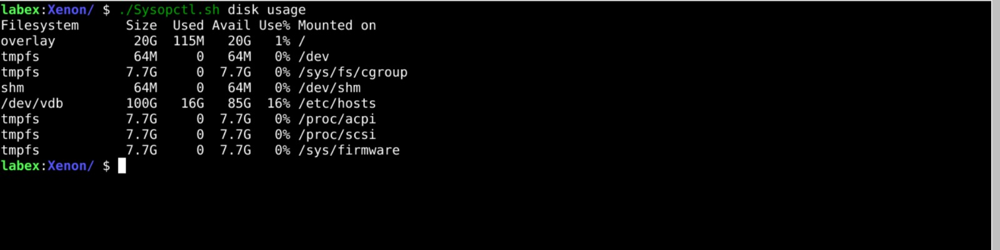
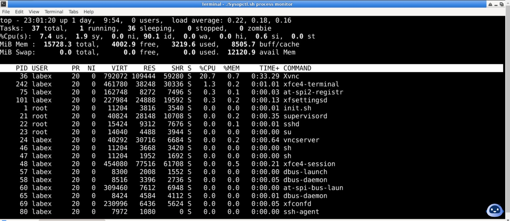
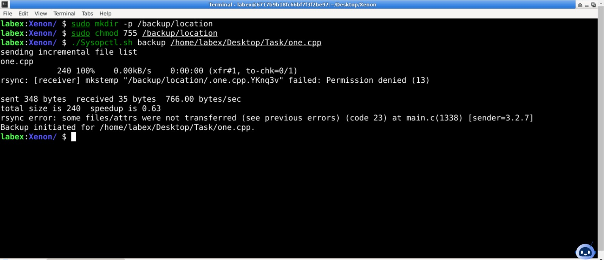

# sysopctl - System Resource and Task Management Command

**Version:** v0.1.0

## Overview

`sysopctl` is a custom Bash-based command-line tool designed for system administrators to manage system services, processes, and monitor system health. It provides easy access to frequently used system management tasks, making it more efficient to control and monitor system resources.

## Features

### Documentation & Basic Features (Section A)

- **Manual Page**  
  A detailed manual is provided to explain the usage of `sysopctl`. Users can access the manual page using:

  ```bash
  $ man sysopctl
  ```

- **Help Option**  
  To view a quick guide on how to use `sysopctl` along with examples:

  ```bash
  $ sysopctl --help
  ```

  

- **Version Information**  
  To check the current version of `sysopctl`, use:

  ```bash
  $ sysopctl --version
  ```

  

### System Management Operations (Section B)

#### Part 1 | Level Easy

- **List Running Services**  
  View a list of all currently active services:

  ```bash
  $ sysopctl service list
  ```

  

- **View System Load**  
  Check the current system load averages:

  ```bash
  $ sysopctl system load
  ```

  

#### Part 2 | Level Intermediate

- **Start a Service**  
  Start a specific system service by name:

  ```bash
  $ sysopctl service start <service-name>
  ```

  Example:

  ```bash
  $ sysopctl service start nginx
  ```

  

- **Stop a Service**  
  Stop a specific system service by name:

  ```bash
  $ sysopctl service stop <service-name>
  ```

  Example:

  ```bash
  $ sysopctl service stop nginx
  ```

  

- **Check Disk Usage**  
  View disk usage statistics by partition:

  ```bash
  $ sysopctl disk usage
  ```

  

#### Part 3 | Advanced Level

- **Monitor System Processes**  
  Monitor real-time process activity:

  ```bash
  $ sysopctl process monitor
  ```

  

- **Backup System Files**  
  Create a backup of system files from the specified path using `rsync`:

  ```bash
  $ sysopctl backup <path>
  ```

  Example:

  ```bash
  $ sysopctl backup /etc
  ```

  

---
